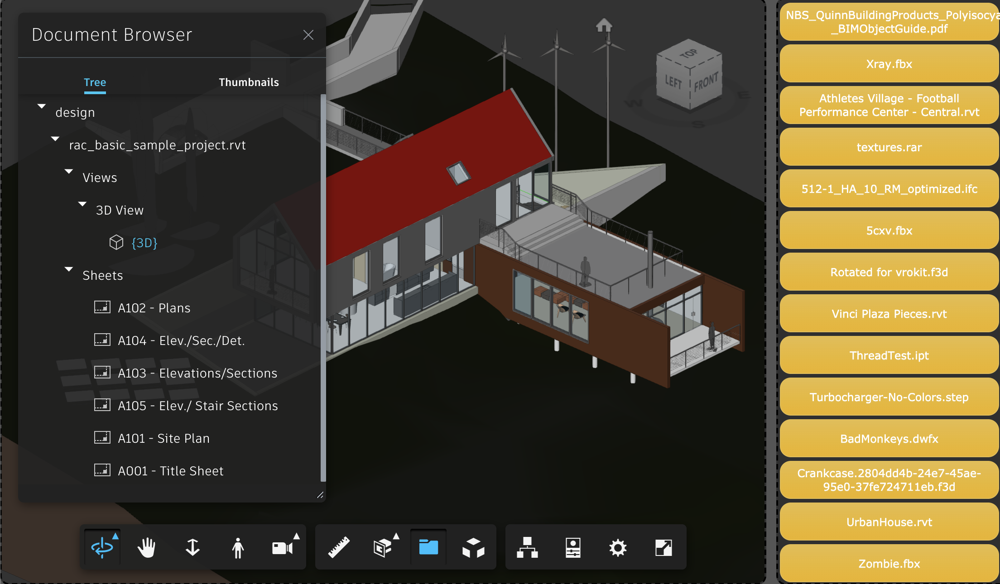

[](https://php.net/)

[](http://opensource.org/licenses/MIT)

[](http://developer-autodesk.github.io/)
[](http://developer-autodesk.github.io/)
[](http://developer-autodesk.github.io/)
[](http://developer-autodesk.github.io/)

# Simple Forge Sample (supports 2 and 3 legged)

<b>Note:</b> For using this sample, you need a valid oAuth credential.
Visit this [page](https://forge.autodesk.com) for instructions to get on-board.


## Description

This sample exercises the PHP7 engine to demonstrate the Forge OAuth authorisation process and most of the Forge Services API such as DAta Management, Bim360, Viewer, ...

Demonstrates the use of the Autodesk Forge API using a PHP7 application. Supports both 2 legged and 3 legged protocols.

## Prerequisites

1. **Forge Account**: Learn how to create a Forge Account, activate subscription and create an app at [this tutorial](http://learnforge.autodesk.io/#/account/).
2. **Visual Studio Code**: other text editors could be used too, but Visual Studio Code is a widely used editor, see [https://code.visualstudio.com/](https://code.visualstudio.com/).
3. **PHP7**: basic knowledge of PHP, see [https://php.net/](https://php.net/).
4. **JavaScript**: basic knowledge.
5. If you want to use the BIM360 API - **BIM 360 or other Autodesk storage account**: if you want to use it with files from BIM 360 Docs then you must be an Account Admin to add the app integration. [Learn about provisioning](https://forge.autodesk.com/blog/bim-360-docs-provisioning-forge-apps).

## Setup/Usage Instructions

  1. Install [PHP7](https://php.net)
  2. Download (fork, or clone) this project
  3. Install PHP dependency modules:<br />
     ```
     php composer.phar install
     ```
  4. Request your consumer client/secret keys from [https://forge.autodesk.com](https://forge.autodesk.com).
  5. **Note** for the 3 legged sample: while registering your keys, make sure that the callback you define for your callback (or redirect_uri) match your localhost and PORT number.
  6. Provision your application key on the BIM360 application integration page. [Learn about provisioning](https://forge.autodesk.com/blog/bim-360-docs-provisioning-forge-apps).

**Note**: Edit the server/.env file and replace the placeholders by the values listed above.

## Usage

todo

# Further reading

Documentation:

- [BIM 360 API](https://developer.autodesk.com/en/docs/bim360/v1/overview/) and [App Provisioning](https://forge.autodesk.com/blog/bim-360-docs-provisioning-forge-apps)
- [Data Management API](https://developer.autodesk.com/en/docs/data/v2/overview/)
- [Viewer](https://developer.autodesk.com/en/docs/viewer/v6)

Tutorials:

- [View BIM 360 Models](http://learnforge.autodesk.io/#/tutorials/viewhubmodels)
- [Retrieve Issues](https://developer.autodesk.com/en/docs/bim360/v1/tutorials/retrieve-issues)

Blogs:

- [Forge Blog](https://forge.autodesk.com/categories/bim-360-api)
- [Field of View](https://fieldofviewblog.wordpress.com/), a BIM focused blog


## License

This sample is licensed under the terms of the [MIT License](http://opensource.org/licenses/MIT).
Please see the [LICENSE](LICENSE) file for full details.

## Written by

Cyrille Fauvel <br />
Forge Developer Advocacy and Support <br />
https://forge.autodesk.com/ <br />
https://around-the-corner.typepad.com <br />

### Thumbnail

